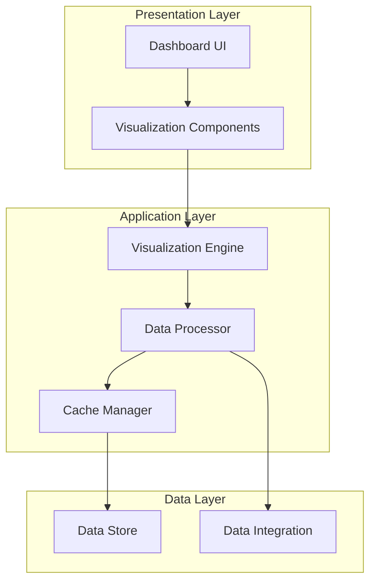

# District Court Caseload Dashboard - System Architecture Design

## 1. System Purpose & Goals

### Primary Purpose
The District Court Caseload Dashboard is designed to provide a comprehensive visualization and analysis platform for monitoring court caseload metrics. The system will enable stakeholders to track, analyze, and make data-driven decisions based on caseload patterns and trends.

### Key Goals
- Deliver real-time visibility into district court caseload metrics
- Provide an intuitive, interactive dashboard interface
- Ensure scalable data processing and visualization
- Maintain high performance with large datasets
- Support containerized deployment for consistency

## 2. Architecture Pattern Selection

### Selected Pattern: Multi-Tier Architecture with Event-Driven Components
The system will implement a modified three-tier architecture with event-driven components, optimized for dashboard applications:

1. **Presentation Tier**: Dash-based interactive dashboard
2. **Application Tier**: Data processing and business logic
3. **Data Tier**: Data storage and integration layer

### Pattern Justification
- Separation of concerns between data, logic, and presentation
- Optimal for real-time dashboard updates
- Supports scalability and maintainability
- Aligns with Dash/Plotly architecture patterns

## 3. Core Components

### 3.1 Dashboard Interface Component
**Primary Responsibility**: User interface and visualization presentation
- Technology: dash-core-components, dash-html-components
- Key Features:
  - Interactive dashboard layout
  - Real-time metric updates
  - Responsive design
  - Component-based structure

### 3.2 Data Processing Engine
**Primary Responsibility**: Data transformation and analysis
- Technology: pandas
- Key Features:
  - Data cleaning and normalization
  - Metric calculation
  - Aggregation pipeline
  - Caching layer

### 3.3 Visualization Engine
**Primary Responsibility**: Chart and graph generation
- Technology: plotly
- Key Features:
  - Interactive visualizations
  - Dynamic chart updates
  - Custom visualization templates
  - Export capabilities

### 3.4 Container Orchestration
**Primary Responsibility**: Application deployment and scaling
- Technology: docker, docker-compose
- Key Features:
  - Environment isolation
  - Service orchestration
  - Resource management
  - Configuration management

## 4. Component Relationships



## 5. Project Structure

```
district-court-dashboard/
├── src/
│   ├── components/           # Reusable dashboard components
│   ├── data/                # Data processing modules
│   ├── visualizations/      # Visualization configurations
│   └── utils/               # Helper functions
├── tests/                   # Test suites
├── config/                  # Configuration files
├── docker/                  # Docker configuration
└── docs/                    # Documentation
```

## 6. Technology Mapping

### Frontend Layer
- Dash 2.18.1
- dash-core-components 2.0.0
- dash-html-components 2.0.0

### Data Processing Layer
- pandas 2.2.3
- Custom data processing modules

### Visualization Layer
- plotly 5.24.1
- Custom visualization templates

### Infrastructure Layer
- docker 7.0.0
- docker-compose 1.29.2

## 7. Development Guidelines

### 7.1 Architecture Principles
1. **Separation of Concerns**
   - Clear component boundaries
   - Modular design
   - Independent scaling

2. **Data Flow**
   - Unidirectional data flow
   - Clear state management
   - Cached intermediates

3. **Error Handling**
   - Graceful degradation
   - Comprehensive logging
   - User feedback

### 7.2 Coding Standards
1. **Python Style**
   - Follow PEP 8 guidelines
   - Type hints for function signatures
   - Comprehensive docstrings

2. **Component Design**
   - Single responsibility principle
   - Interface-based design
   - Dependency injection

3. **Testing Requirements**
   - Unit tests for core logic
   - Integration tests for data flow
   - Performance benchmarks

### 7.3 Best Practices
1. **Data Processing**
   - Efficient pandas operations
   - Proper memory management
   - Chunked processing for large datasets

2. **Visualization**
   - Consistent design language
   - Performance optimization
   - Accessibility compliance

3. **Deployment**
   - Container-first approach
   - Environment parity
   - Configuration as code

## 8. Performance Considerations

### 8.1 Data Processing
- Implement caching for frequently accessed data
- Use pandas optimized operations
- Batch processing for large datasets

### 8.2 Visualization
- Lazy loading of visualization components
- Progressive loading for large datasets
- Client-side caching

### 8.3 Scaling
- Horizontal scaling through containerization
- Load balancing configuration
- Resource optimization

## 9. Security Considerations

### 9.1 Data Protection
- Input validation
- Data sanitization
- Access control

### 9.2 Application Security
- Container security
- Dependency scanning
- Regular updates

## 10. Monitoring and Maintenance

### 10.1 Performance Monitoring
- Response time tracking
- Resource utilization
- Error rates

### 10.2 Maintenance Procedures
- Regular dependency updates
- Performance optimization
- Code quality reviews

## 11. Future Considerations

### 11.1 Scalability
- Support for additional metrics
- Integration with external systems
- Enhanced visualization capabilities

### 11.2 Features
- Advanced analytics
- Custom reporting
- API integration

This architecture design provides a solid foundation for building the District Court Caseload Dashboard while ensuring scalability, maintainability, and performance. The design leverages the specified technology stack effectively while following best practices for dashboard development.