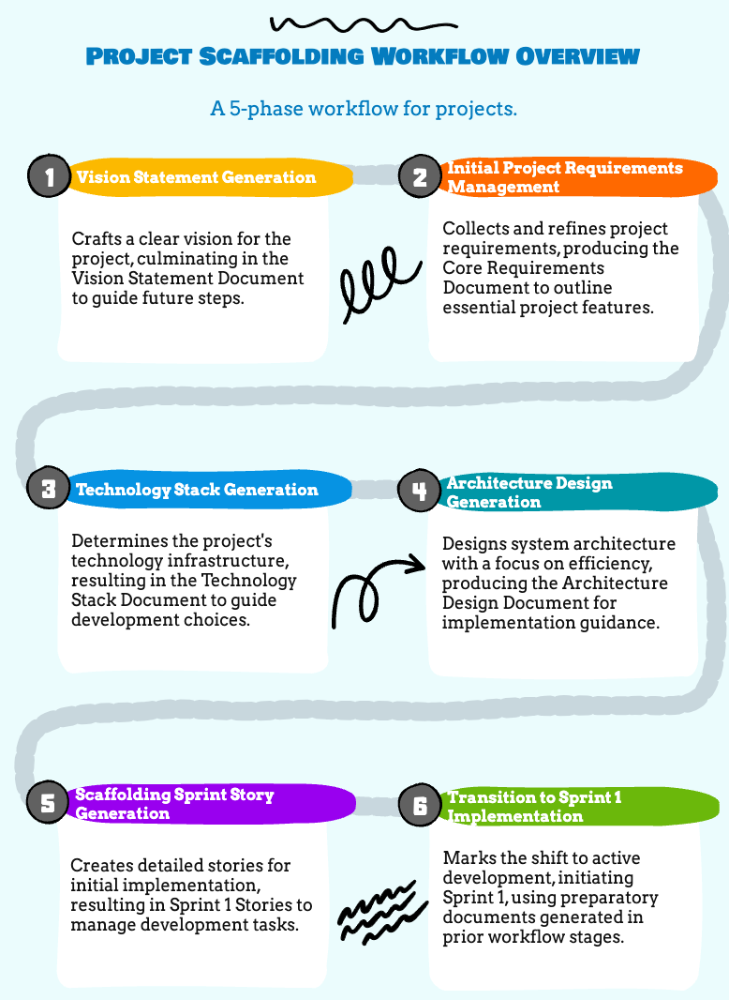

# Project Scaffolding Workflow Chain: AI-Assisted Planning

## Overview

**Note: This workflow is designed for projects that are in the initial scaffolding phase. It assumes no prior project structure, dependencies, or core technologies are in place.**

Below is a visual representation of the workflow (simplified for brevity). Each phase has an associated prompt to guide the developer through that phase.



This workflow represents a chained sequence of AI-assisted processes for planning the initial project scaffolding. Each phase produces specific outputs that become required inputs for subsequent phases, creating a connected chain of development activities.

The workflow operates through the following sequential phases:

```
Phase 1: Vision Statement Generation
↓ [Outputs feed Phase 2]
Phase 2: Initial Project Requirements Management
↓ [Outputs feed Phase 3]
Phase 3: Technology Stack Generation
↓ [Outputs feed Phase 4]
Phase 4: Architecture Design Generation
↓ [Outputs feed Phase 5]
Phase 5: Scaffolding Sprint Story Generation
```

## Input/Output Chain

### Phase 1: Vision Statement Generation

[Vision Statement Generation Prompt](/prompts/planning/assistant-specific/cursor/vision-statement-prompt-simple.md)

#### Purpose

Define a comprehensive project vision statement that aligns with project requirements.

**Initial Inputs Required:**

- Project idea or problem statement
- Project goals and objectives
- Target users/stakeholders

**Key Outputs → [Feed into Phase 2]:**

- Vision Statement Document

### Phase 2: Initial Project Requirements Management

[Initial Project Requirements Management Prompt](/prompts/requirements/assistant-specific/cursor/initial-project-requirements-management-prompt-simple.md)

#### Purpose

Define and document core project requirements based on the vision statement.

**Required Inputs (including Phase 1 outputs):**

- Vision Statement Document
- Project constraints and limitations
- Initial feature ideas (if any)

**Key Outputs → [Feed into Phase 3]:**

- Core Requirements Document

### Phase 3: Technology Stack Generation

[Technology Stack Generation Prompt](/prompts/architecture/assistant-specific/cursor/tech-stack-prompt-simple.md)

#### Purpose

Define and document a compatible, version-locked technology stack.

**Required Inputs (including Phase 2 outputs):**

- Core Requirements Document
- Any existing dependencies or technical constraints
- Performance requirements
- Scalability needs

**Key Outputs → [Feed into Phase 4]:**

- Technology Stack Document

### Phase 4: Architecture Design Generation

[Architecture Design Generator Prompt](/prompts/architecture/assistant-specific/cursor/architecture-design-prompt-simple.md)

#### Purpose

Define core architectural components needed for initial project scaffolding.

**Required Inputs (including Phase 3 outputs):**

- Technology Stack Document
- System requirements and constraints
- Integration requirements
- Security requirements

**Key Outputs → [Feed into Phase 5]:**

- Architecture Design Document

### Phase 5: Scaffolding Sprint Story Generation

[Scaffolding Sprint Story Generation Prompt](/prompts/planning/assistant-specific/cursor/scaffolding-sprint-story-generation-prompt-simple.md)

#### Purpose

Generate focused user stories for the initial project scaffolding sprint.

**Required Inputs (including Phase 4 outputs):**

- Architecture Design Document
- Technical dependencies and constraints
- Development environment setup requirements
- Initial deployment considerations

**Key Outputs:**

- Sprint 1 Stories

## Best Practices

1. **Documentation**

   - Maintain clear documentation for each phase
   - Document all decisions and their rationales
   - Keep track of any assumptions made

2. **Phase Transitions**

   - Explicitly verify all required outputs exist
   - Validate output quality before proceeding
   - Document any assumptions or decisions

3. **Version Control**

   - Commit documentation after each phase
   - Use clear commit messages that reference the phase
   - Maintain a clean history of the planning process

4. **Quality Assurance**

   - Review outputs for completeness
   - Ensure alignment with project goals
   - Validate technical feasibility of decisions

5. **Collaboration**
   - Share outputs with stakeholders
   - Incorporate feedback at each phase
   - Maintain clear communication channels
